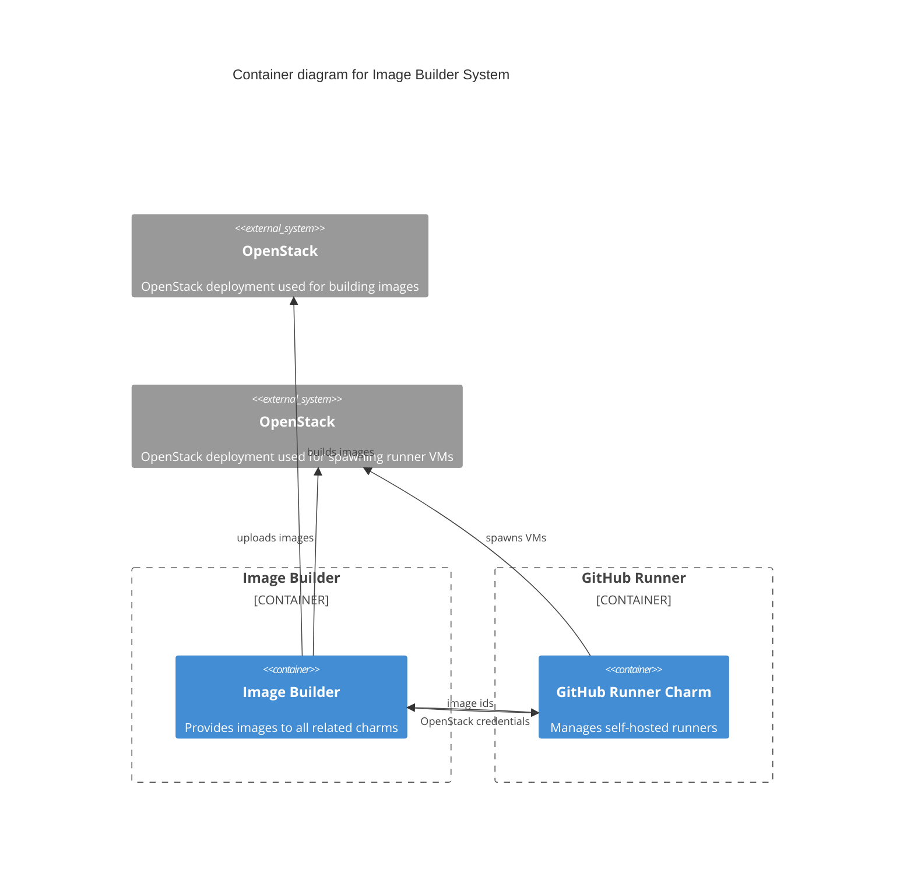
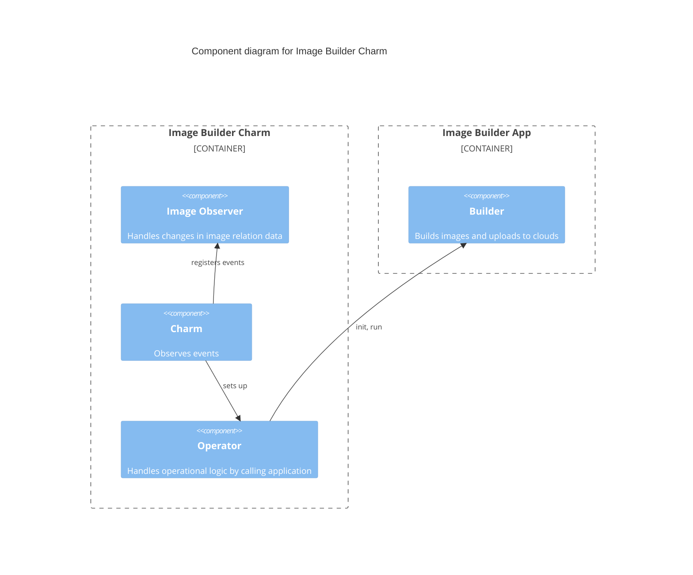

# Charm architecture

The GitHub Runner Image Builder is a machine charm responsible for managing an application ("image-builder")
that creates and stores VM images suitable for use by self-hosted GitHub Runners using OpenStack. 
The image-builder source code is hosted in the [github-runner-image-builder GitHub repository](https://github.com/canonical/github-runner-image-builder).



The image-builder uses an OpenStack cloud to build images. 
Through integration with another charm, the charm obtains the credentials to upload the images to a specified OpenStack project,
which can then be reused by the other charm to spawn VM instances with the necessary software preinstalled.

The image-builder uses the [OpenStack SDK](https://docs.openstack.org/openstacksdk/latest/)  to spawn a VM instance in a cloud specified
by a config option. Using an external OpenStack VM instead of the charm's machine allows for more features
(using chroot has some limitations, e.g. for building snaps) and parallel image building.
[cloud-init](https://cloud-init.io/) is used to install the necessary dependencies for spawning self-hosted runners
([github actions runner binary](https://github.com/actions/runner)) and tools for automatic proxy support ([aproxy](https://github.com/canonical/aproxy)). 
In addition, software that is heavily used in Canonical projects (such as [Juju](https://juju.is/) or [MicroK8s](https://microk8s.io/)) 
can be configured to be pre-installed to reduce the actual CI runtime (as users do not have to install this software in their respective CI runs). 
There is also a custom script configuration combined with a secret that is run in the cloud-init script to allow further customization of the images.
The image-builder repeatedly checks to see if the cloud-init script has finished successfully, then snapshots the VM, uploads the image to a specified OpenStack project
and deletes the VM. This specified OpenStack project is determined via the `image:github_runner_image_v0` integration with another charm (e.g. [GitHub Runner Charm](https://charmhub.io/github-runner)).

The other charm can then use the image to create a VM instance with the required software preinstalled. It receives
the image ID from the Image Builder charm via the integration mentioned above.

Depending on the configuration, the charm will trigger multiple image builds in parallel to speed up the process. This
leads to multiple OpenStack VMs in the OpenStack cloud (and requires corresponding OpenStack quotas) and multiple
image IDs in the integration data.

Furthermore, the charm sets up a cron job to build the images periodically to ensure that the latest software is installed in the images.


The interactions between the charm and the image-builder are performed using CLI commands. 
The image-builder application is not daemonized and stops running after the image has been built
and uploaded to OpenStack.

The image-builder application is initialized by the charm before it can be used. Initialization includes

- Downloading and validating the base images (e.g. Ubuntu 22.04 or 24.04)
- Uploading the base images to OpenStack
- Creating keypairs and security groups in OpenStack 





## Juju events

The following Juju [events](https://juju.is/docs/sdk/event) are observed and handled by the charm as follows:

1. [install](https://juju.is/docs/sdk/install-event): The charm is installed on the machine. The charm initializes the machine by installing dependent software packages,
storing OpenStack credentials on disk and initializing the image-builder application.
2. [config-changed](https://juju.is/docs/sdk/config-changed-event): The configuration of the charm has changed. The charm applies the configuration (e.g. changes to proxy or OpenStack credentials).
3. `run`: This is a [custom event](https://juju.is/docs/sdk/custom-event) that is periodically triggered by a cron job. It is used to call the image-builder application to build the image.
4. `run-action`: This is an [action event](https://juju.is/docs/sdk/action-name-action-event) fired by the user to manually trigger the image-builder to build the image.
5. `image-relation-changed`: This is a [relation event](https://juju.is/docs/sdk/relation-events) that fires when relation data changes. It also triggers the image-builder to build the image.
Once the build is complete, the image-builder will upload the image taking into account the newly changed relation data (e.g. if the OpenStack project has changed).

> See more about events in the Juju docs: [Event](https://juju.is/docs/sdk/event)

## Charm code overview

The `src/charm.py` is the default entry point for a charm and has the GithubRunnerImageBuilderCharm Python class which inherits from CharmBase. CharmBase is the base class 
from which all charms are formed, defined by [Ops](https://juju.is/docs/sdk/ops) (Python framework for developing charms).

> See more in the Juju docs: [Charm](https://juju.is/docs/sdk/constructs#heading--charm)

The `__init__` method guarantees that the charm observes all events relevant to its operation and handles them.

Take, for example, when a configuration is changed by using the CLI.

1. User runs the configuration command:
```bash
juju config github-runner-image-builder build-interval=3
```
2. A `config-changed` event is emitted.
3. In the `__init__` method is defined how to handle this event like this:
```python
self.framework.observe(self.on.config_changed, self._on_config_changed)
```
4. The method `_on_config_changed`, for its turn, will take the necessary actions such as updating the cron job's interval to 3 hours.


The code is structured according to the best practices described in [Managing charm complexity](https://discourse.charmhub.io/t/specification-isd014-managing-charm-complexity/11619).
Therefore, in addition to `src/charm.py`, there are other modules in the charm that are responsible for specific tasks:

- observe changes to image relations
- manage the state of the charm
- abstracting interactions with the image-builder application
- utility functions, proxy configuration and exception definitions