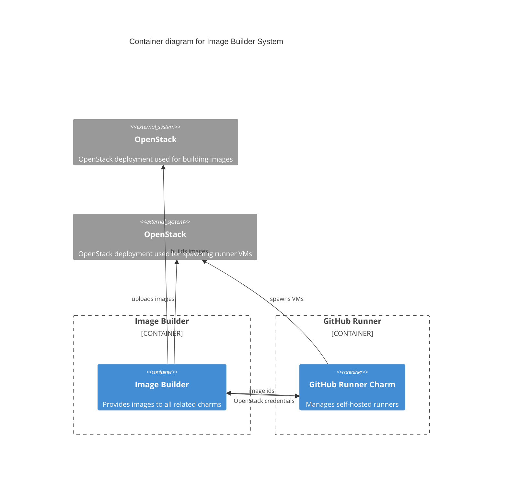

# Charm architecture

The GitHub Runner Image Builder is a machine charm responsible for managing an application ("image-builder")
that builds and stores VM images suitable to be used by self-hosted GitHub runners using Openstack.
The source code of the image-builder is hosted at https://github.com/canonical/github-runner-image-builder . 

The image-builder uses the Openstack SDK to spawn a VM instance in a cloud which has 
been specified via a config option. [cloud-init](https://cloud-init.io/) is used to install the necessary dependencies for
spawning self-hosted runners (github runner binary) and e.g. tools for automatic proxy support (aproxy).
Additionaly, software which is heavily used at Canonical (like juju or microk8s) is pre-installed to
reduce the actual CI run time (as the users do not have to install this software in their respective
CI runs). There is also a custom script configuration combined with a secret that gets executed in 
the cloud-init script to provide further customisation of the images.
The image-builder is repeatedly determining if the cloud-init script has finished running, then
 snapshots it, uploads the image in a specified Openstack project and deletes the VM. This specified
Openstack project is determined via the `image:github_runner_image_v0` integration with another charm (e.g. github-runner charm).
The other charm can then use the image to spawn a VM instance with the necessary software pre-installed.

The interactions between the charm and the image-builder are performed using CLI commands. The image-builder
application is not daemonized and stops running after the image has been built and uploaded to Openstack.

The image-builder application needs to be initialized before it can be used. Initialisation includes

- downloading and validating the base images (e.g. ubuntu 22.04 or 24.04)
- uploading the base images to Openstack
- creating keypairs and security groups in Openstack

The charm is setting up a cron job to periodically build the images.





## Juju events

The following juju [events]((https://juju.is/docs/sdk/event) are observed and handled as follows by the charm:

1. [install](https://juju.is/docs/sdk/install-event): The charm is being installed on the machine. The charm initialises
the machine by installing dependent software packages, storing openstack credentials on the disk and
initializing the image-builder application.
2. [config-changed](https://juju.is/docs/sdk/config-changed-event): The charm configuration has changed. The charm
applies the configuration (e.g. changes to proxy or Openstack credentials).
3. `run`: This is a [custom event](https://juju.is/docs/sdk/custom-event) that is triggered periodically by a cronjob.
It is used to call the image-builder application to build the image.
4. `run-action`: This is an [action event](https://juju.is/docs/sdk/action-name-action-event) that is triggered by the user to 
manually trigger the image-builder application to build the image.
5. `image-relation-changed`: This is a [relation event](https://juju.is/docs/sdk/relation-events) that is
fired upon a change of relation data. It does also trigger the image-builder application to build the image. After a finished build, the image-builder
will upload the image respecting the newly changed relation data (e.g. if the Openstack project has changed).

   
> See more about events in the Juju docs: [Event](https://juju.is/docs/sdk/event)

## Charm code overview

The `src/charm.py` is the default entry point for a charm and has the <relevant-charm-class> Python class which inherits from CharmBase. CharmBase is the base class 
from which all Charms are formed, defined by [Ops](https://juju.is/docs/sdk/ops) (Python framework for developing charms).

> See more in the Juju docs: [Charm](https://juju.is/docs/sdk/constructs#heading--charm)

The `__init__` method guarantees that the charm observes all events relevant to its operation and handles them.

Take, for example, when a configuration is changed by using the CLI.

1. User runs the configuration command:
```bash
juju config <relevant-charm-configuration>
```
2. A `config-changed` event is emitted.
3. In the `__init__` method is defined how to handle this event like this:
```python
self.framework.observe(self.on.config_changed, self._on_config_changed)
```
4. The method `_on_config_changed`, for its turn, will take the necessary actions such as waiting for all the relations to be ready and then configuring the containers.